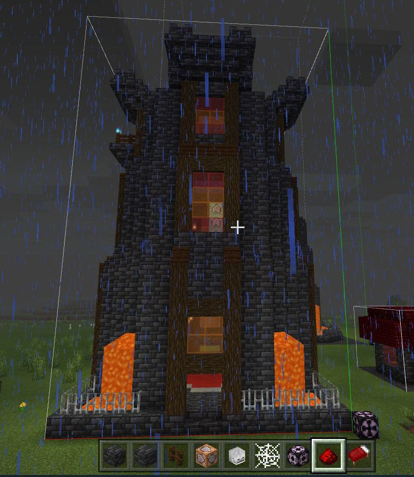

This is a simple add-on for Minecraft. It adds some magical elements to the game...
- Implemented
  - **Flame wand**: Causes `catch_fire` on hit.
  - **Storm wand**: Summons a `lightning_bolt` on hit.
  - **Frost wand**: Inflict `slow` effect on the target
    - Freezes water source blocks (but not flowing water, by design)
    - Turns lava into obsidian/cobblestone
    - Douses fire
    - Wanted to implement `freeze` but it's not a formal status effect :(
  - **Dark wand**: Causes `wither` effect on target.
  - **Float wand**: Target gains `levitation` for 10 seconds.
  - **Evoker wand**: Summons a row of 'evoker fangs' in front of the player.
  - **Blast wand**: Creates a TNT-like explosion upon hit.
  - **Teleport Amulet**: Teleports the player 100 blocks in the direction they're facing
  - **Float Amulet**: Grants `levitation` for 5 seconds and `slow_falling` for 8 seconds.
  - **Resistance Potion**: Grants `resistance` effect
  - **Haste Potion**: Grants `haste` effect
  - **Wizard Outpost**: A structure that spawns in Mesa biomes. Contains mobs and loot used to craft wands.
- Planned
  - **Teleporters**: Would like to use nametags to link two teleporters and/or teleport 1K blocks in a given direction based on block orientation.
  - **Wizard Tower**: A larger version of the Wizard Outpost with more mobs/traps.
  - Custom mobs to populate the new structures.

  
  
  
  
  
  
  
