# Magic Expansion for Minecraft
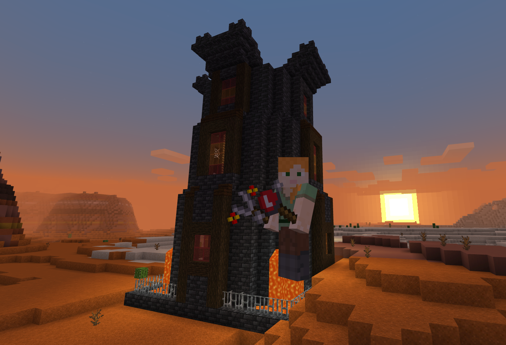

This is a simple add-on for Minecraft. It adds some magical elements to the game...
## Implemented
- **Flame wand**: Causes `catch_fire` on hit.
- **Storm wand**: Summons a `lightning_bolt` on hit.
- **Frost wand**: Inflict `slow` effect on the target
  - Freezes water source blocks (but not flowing water, by design)
  - Turns lava into obsidian/cobblestone
  - Douses fire
  - Wanted to implement `freeze` but it's not a formal status effect :(
- **Dark wand**: Causes `wither` effect on target.
- **Float wand**: Target gains `levitation` for 10 seconds.
- **Evoker wand**: Summons a row of 'evoker fangs' in front of the player.
- **Blast wand**: Creates a TNT-like explosion upon hit.
- **Teleport Amulet**: Teleports the player 100 blocks in the direction they're facing
- **Float Amulet**: Grants `levitation` for 5 seconds and `slow_falling` for 8 seconds.
- **Resistance Potion**: Grants `resistance` effect
- **Haste Potion**: Grants `haste` effect
- **Wizard Outpost**: A structure that spawns in Mesa biomes. Contains mobs and loot used to craft wands.
## Planned
- **Teleporters**: Would like to use nametags to link two teleporters and/or teleport 1K blocks in a given direction based on block orientation.
- **Wizard Tower**: A larger version of the Wizard Outpost with more mobs/traps.
- Custom mobs to populate the new structures.

# Installation
1. Download the latest addon from the [releases page](https://github.com/thebearup/magic_expansion_for_minecraft/releases)
2. Follow the instructions based on your platform
    - [Windows 10/Android/iPad](https://www.minecraft.net/en-us/addons)
      - The easiest way
    - [Xbox](https://youtu.be/754amkN3dok?t=15)
      - Basically download via the Edge browser and install with [MC Addons Manager](https://www.microsoft.com/en-us/p/mc-addons-manager/9p8r42ntgllt?activetab=pivot:overviewtab)
    - [PS4](https://www.youtube.com/watch?v=BoDSPuH4x_U&ab_channel=AntonyandHarryGames)
      - Push the addon to a world/realm via a supported platform, then connect from your PS4.
    - [Switch](https://gaming.stackexchange.com/questions/384024/how-can-i-add-add-ons-to-my-game-on-the-nintendo-switch)
      - Fairly convoluted - can use the PS4 method instead.
3. Enable `Holiday Creator Features` and `Custom Biomes` in world settings.
    - `Holiday Creator Features` will enable all the new equipment.
    - `Custom Biomes` will enable the **Wizard Tower** but only in chunks you haven't already visited.
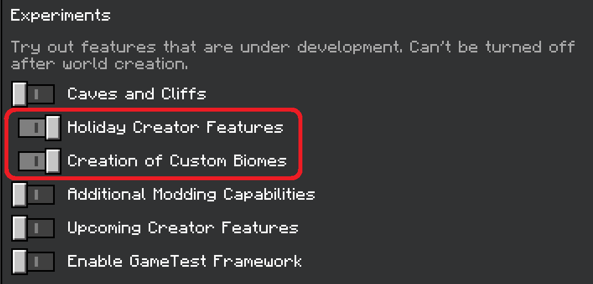

# New Equipment
|   |   |
|---|---|
|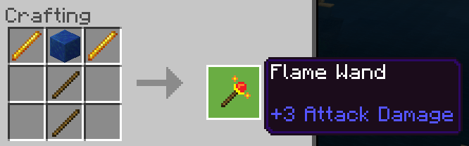|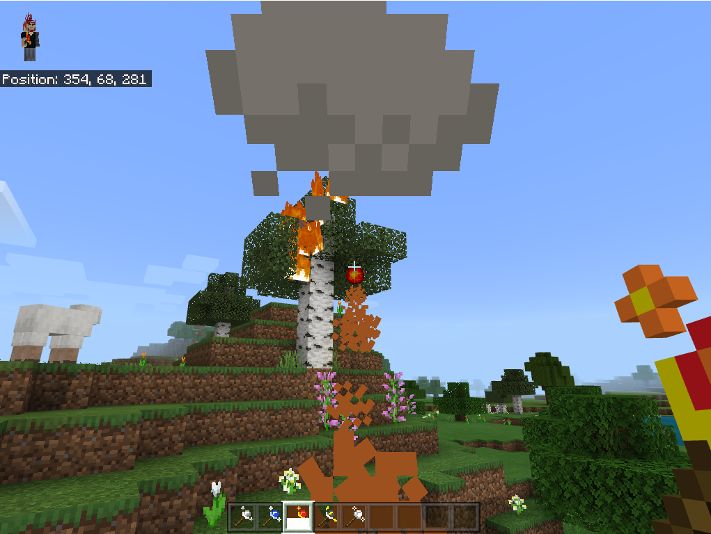|
|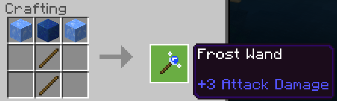|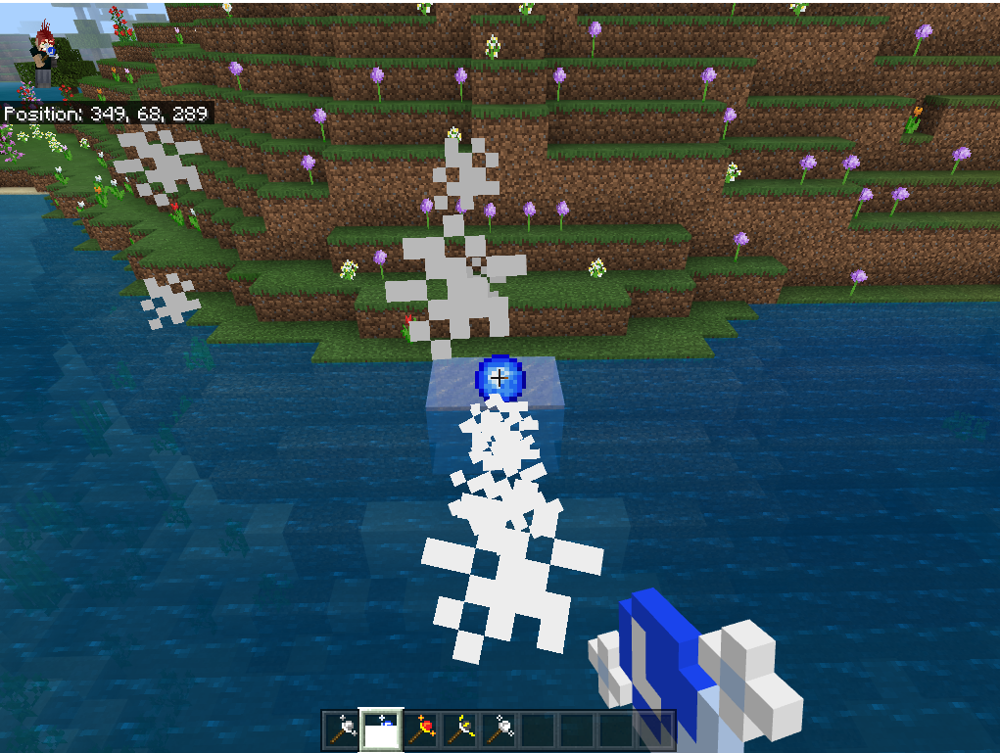|
|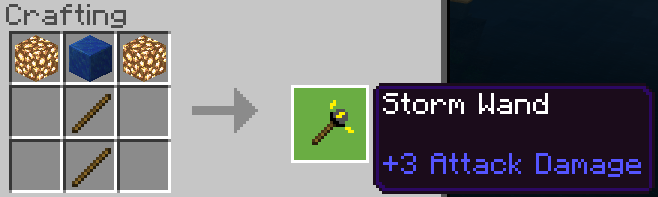|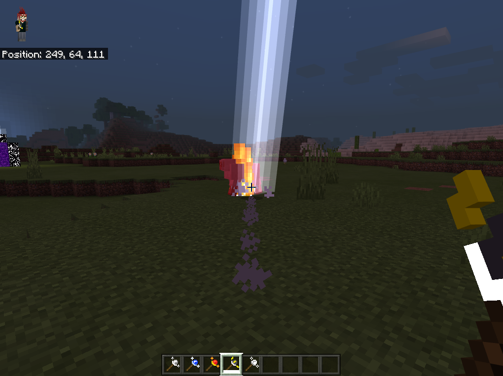|
|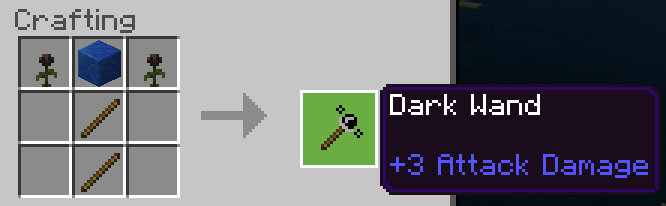|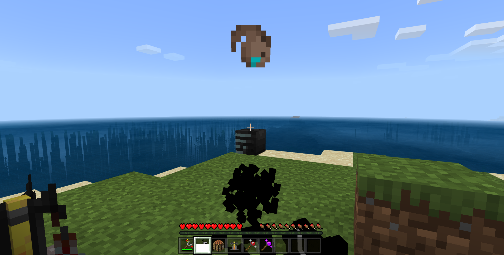|
|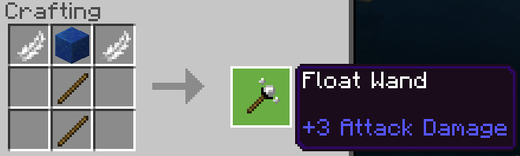|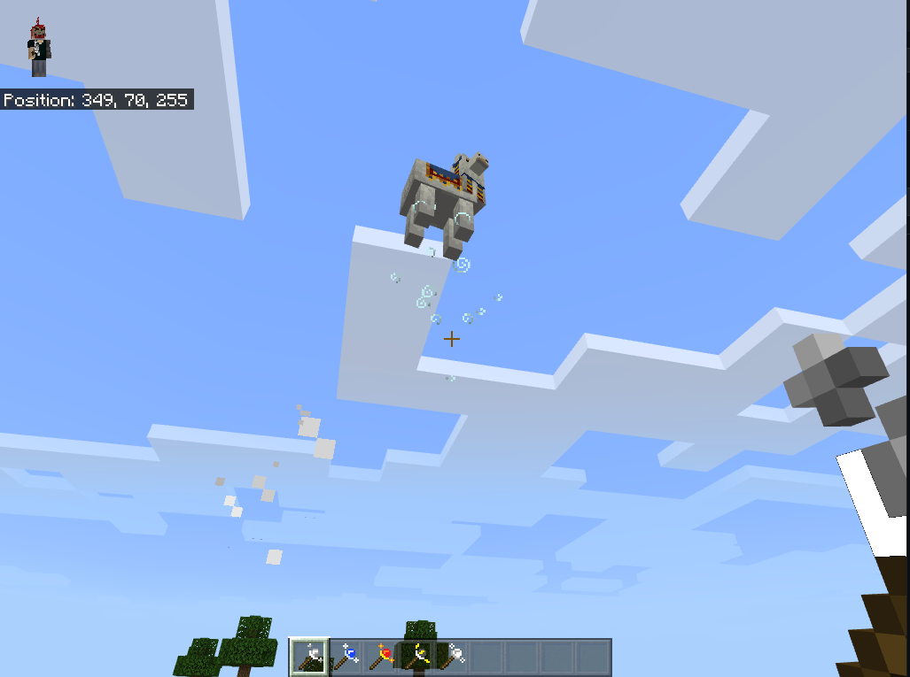|
|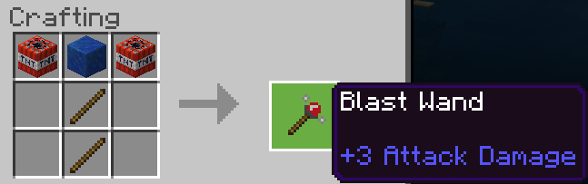|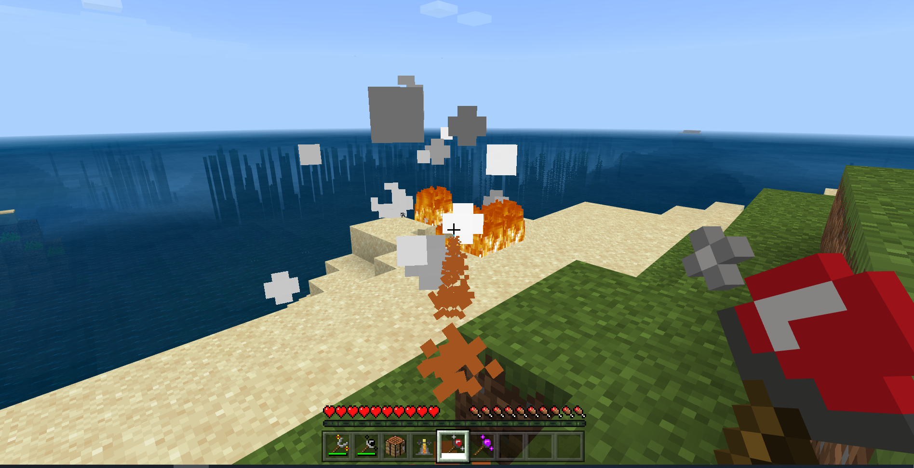|
|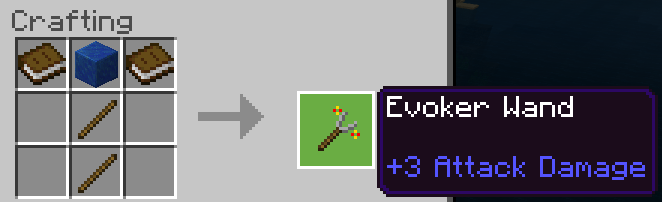|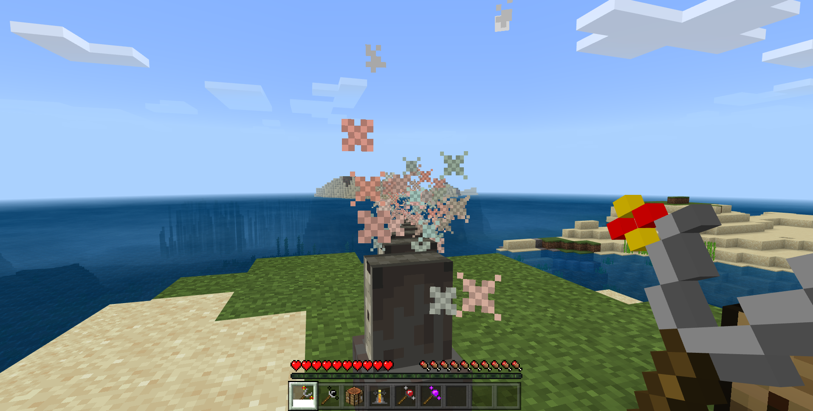|
|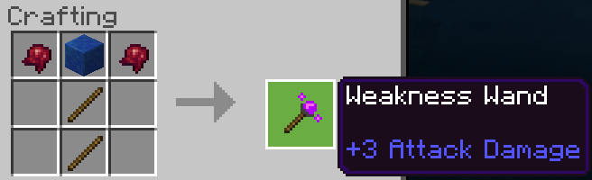|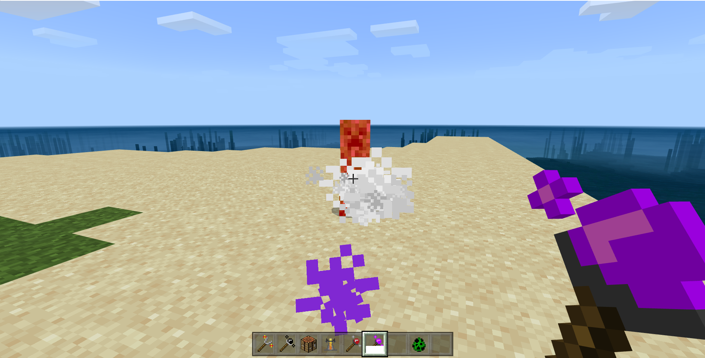|

|   |   |
|---|---|
|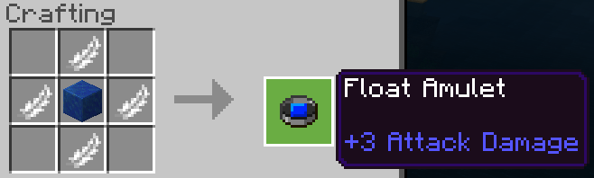|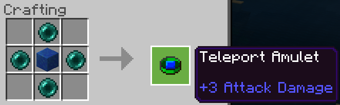|
|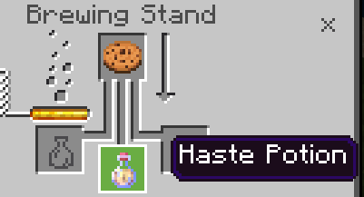|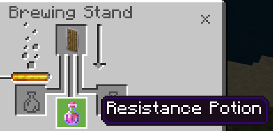|
