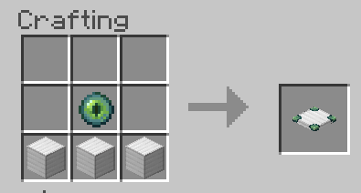
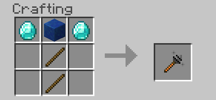
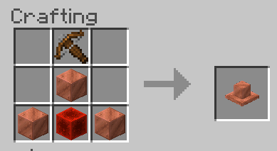
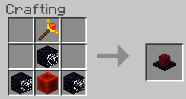
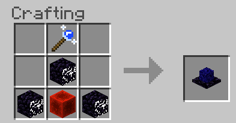

# Magic Expansion for Minecraft

This is a simple add-on for Minecraft. It adds some magical elements to the game...
## Implemented
### Wands
- **Blast wand**: Creates a TNT-like explosion upon hit.
- **Boring Wand**: Clears a 3x2x5 space in front of the player. Removes most common blocks (stone, gravel, netherrack, etc).
- **Dark wand**: Causes `wither` effect on target.
- **Evoker wand**: Summons a row of 'evoker fangs' in front of the player.
- **Flame wand**: Causes `catch_fire` on hit.
- **Float wand**: Target gains `levitation` for 10 seconds.
- **Frost wand**: Inflict `slow` effect on the target
  - Freezes water source blocks (but not flowing water, by design)
  - Turns lava into obsidian/cobblestone
  - Douses fire
  - Wanted to implement `freeze` but it's not a formal status effect :(
- **Poison wand**: Inflicts `fatal_poison` on the target
- **Storm wand**: Summons a `lightning_bolt` on hit.
- **Teleport wand**: Teleports the target entity to the home terminus.
    - Makes it easier to transport mobs.
    - Should nametag the entity first, so it doesn't despawn.
- **Weakness wand**: Inflicts `weakness` on the target

### Items
- **Enchanted Totem**: Teleports to Home Terminus.
    - Prior to 1.2, this would teleport the player to an Enchanting table.
    - Resembles homeward bone from Dark Souls.
- **Experience Bottles**: More potent variants of the `xp_bottle`.
- **Float Amulet**: Grants `levitation` for 5 seconds and `slow_falling` for 8 seconds.
- **Haste Potion**: Grants `haste` effect
- **Resistance Potion**: Grants `resistance` effect
- **Necronomicon**: Summons a Skeleton minion to fight for you
    - Minion expires after 60 seconds
- **Seeing Stone**: Locates Ruined Portals and Nether Fortresses.
    - Crafting ingredient for the **Arcane Locator**.
- **Teleport Amulet**: Teleports the player 100 blocks in the direction they're facing
    - Due to a recent Minecraft update that broke teleporting into unrendered chunks, the safety check is disabled. Be careful where you aim :)

### Blocks
- **Arcane Enchanting Table**: Grants additional enchantments for 16XP levels.
    - Also can exchange experience levels for **experience bottles**.
- **Arcane Locator**: Gives the coordinates of various structures
    - This will temporarily generate command blocks at the world ceiling, but should be minimally disruptive.
    - For some reason the output of the `locate` command is suppressed when called from an item event or NPC. Hence the hacky command-block implementation.
- **Lesser Enchanting Table**: Grants low-level enchantments for 4XP levels.
    - Also grants Silk Touch and Fortune 1
- **Greater Enchanting Table**: Grants high-level enchantments for 8XP levels.
    - Also grants Silk Touch and Fortune 2
- **Shrines**: Provide buffs in a range around the block.
    - Variants include Health, Combat, and Agility.
- **Terminus**: Teleport between locations.
    - 5 craftable types (Home, Copper, Iron, Gold, and Emerald).
    - Automatically adds/removes ticking area when placed/removed. **Limit of 10 ticking areas in Bedrock worlds**.
    - As of 1.2.0, the Diamond Terminus is deprecated in favor of the Home Terminus.
- **Turrets**: Attack nearby mobs iwth ranged attacks
    - Based on snow golem
    - Variants include Crossbow, Flame, and Frost

### Structures
- **Graveyard**: Spawns in various biomes, home to the Necromancer
- **Wizard Outpost**: A structure that spawns in Mesa biomes. Contains Corrupted Golems and loot used to craft wands.

### Mobs
- **Corrupted Golem**: An aggressive, more dangerous variant of the Iron Golem.
    - Spawns in the Wizard Outpost
- **Necromancer**: Mini-boss that summons skeletons and husks to engage the player.
- **Skeleton Minion**: A friendly skeleton that fights other mobs for 60 seconds.

## Planned
- **Sky Temple**: A building in the sky with unique loot.

# Installation
1. Download the latest addon from the [releases page](https://github.com/thebearup/magic_expansion_for_minecraft/releases)
2. Follow the instructions based on your platform
    - [Windows 10/Android/iPad](https://www.minecraft.net/en-us/addons)
      - The easiest way
    - Xbox/PS#/Switch: This has been deliberately broken by Mojang.
      - Join (or download) a realm where the addons are installed
3. Enable `Holiday Creator Features` and `Custom Biomes` in world settings.
    - `Holiday Creator Features` will enable all the new equipment.
    - `Custom Biomes` will enable the **Wizard Tower** but only in chunks you haven't already visited.

# Recipes/Examples
|   |   |
|---|---|
|||
|||
|||
|||
|||
|||
|||
|||
|||
|||
|||
|||
|||
|||
|||
|||
|||

|   |   |
|---|---|
|||
|||
|||
|||
|||
|||
|||
|||
|||